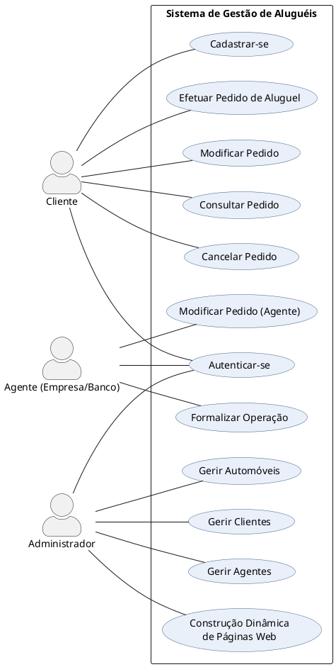

``` plantuml
@startuml
left to right direction
skinparam actorStyle awesome
skinparam usecaseBorderColor #406080
skinparam usecaseBackgroundColor #E9F0FA
skinparam shadowing false

actor "Cliente" as Cliente
actor "Agente (Empresa/Banco)" as Agente
actor "Administrador" as Admin

rectangle "Sistema de Gestão de Aluguéis" {
  ' === Casos de Uso Gerais ===
  usecase "Cadastrar-se" as UC1
  usecase "Autenticar-se" as UC2

  ' === Casos de Uso do Cliente ===
  usecase "Efetuar Pedido de Aluguel" as UC3
  usecase "Modificar Pedido" as UC4
  usecase "Consultar Pedido" as UC5
  usecase "Cancelar Pedido" as UC6

  ' === Casos de Uso do Agente ===
  usecase "Modificar Pedido (Agente)" as UC8
  usecase "Formalizar Operação" as UC_FORMALIZAR


  ' === Casos de Uso do Administrador ===
  usecase "Gerir Automóveis" as UC12
  usecase "Gerir Clientes" as UC13
  usecase "Gerir Agentes" as UC14
  usecase "Construção Dinâmica\nde Páginas Web" as UCWWW
}

' --- Relacionamentos com Atores ---

' Cliente
Cliente -- UC1
Cliente -- UC2
Cliente -- UC3
Cliente -- UC4
Cliente -- UC5
Cliente -- UC6

' Agente
Agente -- UC2 
Agente -- UC8
Agente -- UC_FORMALIZAR

' Administrador
Admin -- UC2 
Admin -- UC12
Admin -- UC13
Admin -- UC14
Admin -- UCWWW

@enduml
```
